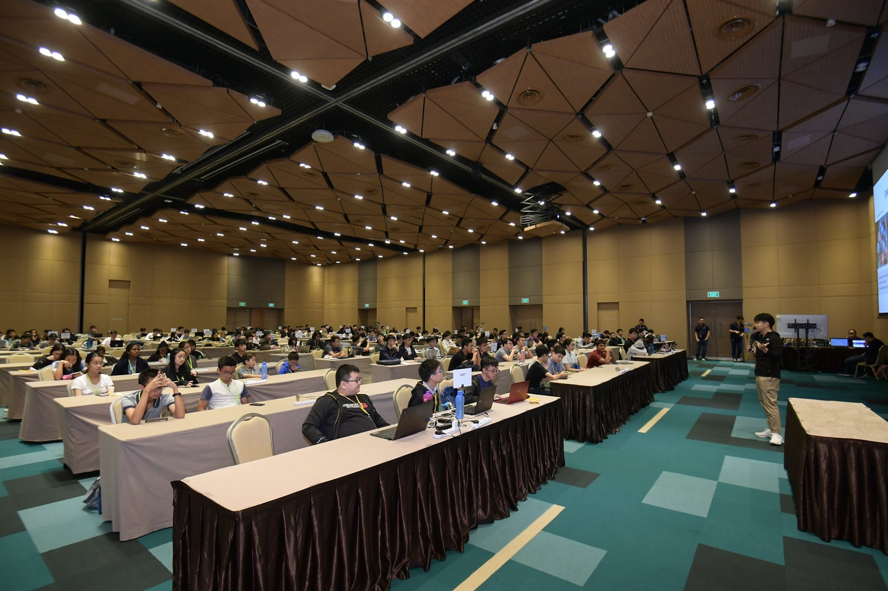

# Brainhack Today I Leanrt(TIL) AI Camp 2019 Write-up
This is a write-up of my experience at Brainhack TIL AI Camp 2019 hosted by DSTA.  
The source code to what I did as well as the team's final code is in this repository.  
For more information on the code, read the [Quick Notes about the Source Code.](#Quick-Notes-about-the-Source-Code)
## Short Version/TL:DR
The hackathon I attended was the [Brainhack TIL AI camp 2019.](#1-Intoduction) This was my first [experience](#2-My-Experience) at a hackathon/coding competition, and was also the first time I was exposed to Artifical Intelligence(AI) and deep learning. Through the camp, we were introduced to the fundementals of deep learning and CNNs for image classification. The challenge was to make a model to classify images into 15 different poses. We managed to get 5th place and won an Amazon Fire 7 tablet for everyone on the team.

## Quick Links
* [DSTA](https://www.dsta.gov.sg/home 'DSTA Homepage')
* [Brainhack Today I Learnt 2019(TIL)](https://dsta.gov.sg/til 'TIL Homepage')
* [Additional Materials such as the models and dataset](https://drive.google.com/drive/folders/1MCkEaMff1PRF3aO44LmIlMR4ayXcWy1M?usp=sharing 'Link To Google drive with the other resources')

## Quick Notes about the Source Code  
The cleaned up source code is in the folder `Python_notebook`. The documentation and explanation for the code are within each notebook itself. The main environment I used was google colab to run most of my code. I suggest you also try out google colab if you plan to do any AI projects in the future.
Example of how the notebook would look like in colab:  

The three notebooks are named as such:
* `For_getting_benchamrk_models` (I suggest you go through this first, this contains the most explanations and documentation)
* `Object_dection_mask_notebook` (If you want to try out mask_rcnn)
* `Final_team_notebook` (I didn't comment much on this notebook as it was just the code we just to generate our final model, explanations were mostly done in the previous notebooks already)

Final note: The pre-trained models and dataset are in [this google drive link](https://drive.google.com/drive/folders/1MCkEaMff1PRF3aO44LmIlMR4ayXcWy1M?usp=sharing 'Link to the google drive').(Didn't upload to Github as it is 4gb alone)

## 1. Intoduction
Note: Before I starting talking about anything, I'd like to point out some things.
* All credit goes to the respective authors of the Github repos and downloaded models used in the notebooks.
* When I refer to the AI camp, I am referring to the whole event.
* The competition refers to the time period after the workshop until the 2 days at the EXPO, where the event was held.
* Competition days refer to the 2 days at the EXPO.
* Timing may not always be accurate(Cause I didnt remember the exact timing) 

### About the AI camp 2019  

**Information about the camp in general**
This camp was hosted by the Defence Science and Technology Agency ([DSTA](https://www.dsta.gov.sg/home 'DSTA Homepage')) as part of their larger event, Brainhack, held every year. (I think)  
The homepage of the camp can be found here. ([Brainhack Today I Learnt 2019(TIL)](https://dsta.gov.sg/til 'TIL Homepage'))  
The Github profile for the camp(and hopefully future camps) can be found [here](https://github.com/brainhack-dsta 'DSTA Brainhack-til Github profile') 

The camp was meant as both a workshop and competition for people who were interested in AI.  
The camp, however, focused on the more specific section of computer vision and using deep learning models to do image analytics.  
The competition's objective was to build a model to classify the pose of the human in an image into their respective classes. 
The training, validation and test dataset was provided by DSTA themselves.

This camp was held for students from Junior Colleges(JC/IP), Polytechnics(Poly), Institute of Technical Education(ITE) and Universities(Unis) in Singapore.  
The students are then split into 2 separate categories, Poly/Uni and JC/IP/ITE.  

The timeline of the event was split into as such:  
  

**Workshop**  
The camp was structured such that we had a workshop before the competition started so as to give everyone some knowledge on how to create deep learning CNN models for image classification. (4/6/2019)  
The workshop used the classic MNST and CIFAR-10 datasets to teach us the basic of deep learning CNNs.  
**Briefing**  
We then had a briefing 2 days later, where the training and validation datasets were released to us. We then had a week to build our models for the competition.  
The original dataset released to us had 11 classes and a total of around 1000 images for both the training and validation dataset.

The workshop and briefing were held at DSTA offices.  

**Competition**  
The competition was held at the EXPO max atria. (Level 2) On the day itself, 3 test datasets and a new training and validation dataset were released.  
This was due to a curveball challenge given to us on the afternoon of the first competition day. They gave us around 3 1/2 hours to adapt our models to 4 new classes.

The day was structured as follows:  

For the First day.

| Time    |                     Activity                     | Remarks                                                                                                    |
| :------ | :----------------------------------------------: | ---------------------------------------------------------------------------------------------------------- |
| 10.00AM |            Release of the test_set_1             | This test set was based on the train and validation set given at the start of the competition (11 classes) |
| 2.30PM  |        Release of the curveball challenge        | New train and validation datasets were released. (4 new classes)                                           |
| 5.00PM  |             New test_set_2 released              | This allowed us to benchmark our model against a test set we have not seen                                 |
| 5.30PM  |     Release of the final_submission_test_set     | We were only allowed one submission for the final test set                                                 |
| 6.00PM  | Deadline of submission for source code and model | Slides were due the next day 8.00AM                                                                        |

For the Second Day.(Not to sure about the accuracy of the timing)

| Time    |               Activity               | Remarks                                                                                                 |
| :------ | :----------------------------------: | ------------------------------------------------------------------------------------------------------- |
| 10.30AM | Pitching/Presentation of top 5 teams | This was when the team's with the top 5 accuracy in the final submission had to present on their models |
| 3.00PM  |          Release of results          | Nuff Said                                                                                               |
### About the Team  

The team, .NEET comprised of(In order of the picture, left to right):
* Jes
* David ([Github Profile](https://github.com/David-The-Programmer 'David's Github Profile'))
* Me, Chuan Hao
* and Sheen Hern

Here's a picture of us together :D.  
  

We formed a team together as we mainly knew each other from either secondary or primary school and all had some interest in AI.

## 2. My Experience  

This section will mainly be going over my thoughts and experiences I had during certain time periods in the camp. A final summary of my thoughts and reflection on the camp can be found in the next section.

### Workshop/Breiefing

This was pretty exciting to me as I only had a background in python and machine learning before coming to the workshop. Through the workshop, I managed to learn the fundamental basics of deep learning and the common libraries used to implement Convolutional Neural Networks(CNN). Working with classic datasets such as the MNST and CIFAR-10 datasets.  
Furthermore, I managed to get to talk to the mentors that were teaching us, more questions, such as different techniques to improve our model's architecture, as well as what to do later on to prepare for the competition. In addition, I got an insight into how the AI industry is currently developing, such as how AI is implemented into everyday devices and the future of AI as a whole.  
All in all, I was mainly focused on trying to learn as much as I could in these 2 days about AI and deep learning, asking as many questions as I could to the mentors.

### Prep to the competition  

After discussing with the team, we decided to try out 4 separate approaches to the problem.  
1. Re-train an existing well-known model's architecture
2. Do transfer-learning on pre-trained models in keras
3. Implement object detection to crop out the humans doing the poses in order to train a CNN to just classify the humans.
4. Some combination of the above (?)

(Sadly I have no pictures of this time period)

### Competition day itself

**Day 1**
I would say this was the most exciting part of the whole camp for me. The experience of being with my teammates, coding together, sharing ideas and helping one another out to try and create the best model we could, was an experience unlike any other. (Looking back it almost seems magical) I would also like to preface the rest of what happened that day with this,
* We were in our first year, and our first semester in SP
* This was our first experience at a hackathon for everyone on the team
* Everyone did not have much experience in AI before the camp
* We were not expecting to win anything, heck we were just glad to be there in the first place(The jacket was pretty cool.)

At 10AM(I think) was the first time a new test set was released for us to benchmark our model against. This would also be the first time we would be comparing our model against other teams models. To the shock of everyone on our team, we managed a staggering 79% accuracy on the first test set. This was using Jes's first iteration of the re-trained VGG16 model. We even managed to get on the leaderboards with that score :D. This gave everyone hope that we might actually be able to get some sort of placing in the end. This also showed that maybe, just maybe we could compete with the university teams. 
Here's a picture:(Sorry for the bad quality)  
  

After this, we continued to discuss on ways we could try and get more accuracy out of our model, as well as what kind of curveball challenge we would get later on. After lunch, DSTA released test_set_2, alongside with the new train and test set with 4 new classes.  

Who could have thought, 4 new classes and 3 1/2 hours to adapt our model to the new dataset? It took us a few minutes to wrap our head around what we were supposed to do, or rather what we could do. As we did not expect this kind of challenge as a curveball, we had no clue what was the proper way to adapt models to new data and we did not have time to research on that. As such, our team agreed to go with the simplest of solutions, and that was to treat the dataset as a completely new dataset and work from scratch. Looking back, this was probably the riskiest course of action we could have taken. We did not know if our model could retrain in time and may not even have a model to submit in the end. We should have tried splitting the team up, with some researching on what we should do and others trying whatever came to mind to at least have a model to show at the end.  

However, our risky plan worked, to some extent. By treating the dataset as a completely new dataset, we just retrained the whole VGG16 model on the new dataset and hoped it would be as good as before. (We did this on Jes's Laptop) At the same time, I retrained my previous Xception model with the new dataset as well. We did this as I knew from previous experience, my Xception model would only take 1 to 2 hours to retrain from scratch, compared to Jes estimation of around 3 hours for his. We were still hoping for Jes VGG16 model to train in time as we expected his model to have higher accuracy. Therefore my model acted as a safety net for us if Jes model did not train in time. In the meantime, as the model trained, Jes and I worked on cleaning up some of his code for submission. I also got ready the code for submission of our model. 

3 hours and 15 minutes passed, it seems as though Jes model has reached the highest accuracy it would ever reach. It managed to get an impressive 73% validation accuracy. We all agreed this was probably the best accuracy it would get and then submitted that model along with its source code to DSTA. We then began to turn our attention to making slides for pitching/presenting the next day.  

At this point, we once again had no idea what to expect, as on the submission test_set, we got 74.9% accuracy. Thinking nothing of it, we just had fun designing the slides to the best of our abilities as only the top 5 teams with the best accuracy would be presenting. We focused on showing what we did and our process rather than trying to win the competition at this point.  

**Day 2**

As day 2 began, we came back to EXPO not knowing what to expect. On one hand, we really were not expecting to get any sort of placing in the top 5. On the other hand, we really hoped that we did well enough to get into the top 5. To our surprise again,(I think I'm starting to see a pattern here) we got 5th place in our category and would presenting later on in the day!  
Here the picture:  

We began cheering among ourselves and patting each other on the back. We actually did it! As first years in SP and in our first hackathon, we actually managed to get something. (Top 5 were guaranteed something) After calming down, we then began thinking about how we would be presenting our slides later on in the day.  

Well as you can expect, we came in 5th in the end after the [presentation](https://drive.google.com/drive/folders/1MCkEaMff1PRF3aO44LmIlMR4ayXcWy1M?usp=sharing 'Link To Google drive with the other resources'):D.  
Photo of us presenting:  

In the end, we won an Amazon Fire 7 tablet for everyone on the team. (Will add a picture later on)
Afterwards, we went around to check out the tech showcase being held by DSTA and some people from the industry at EXPO.

Well, this concludes my experience in Brainhack TIL 2019 AI camp. I would like to extend my thanks to the people who helped out in the event, DSTA for hosting the event and my teammates for this wonderful experience.

## 3. Conlusion
All in all, the camp not only introduced me to deep learning and AI but also built up my interest in the field as a whole. After talking with some of the people in working in AI in DSTA as well as in the industry, I realised there is still a lot more I can research on and do with AI. The camp also showed me that even now, I can start to look more into AI or any field in IT for that matter.  
I guess the learning point is that age does not really limit what you can do in IT. As long as you go at your own pace, you can achieve great things regards of your age. I am now definitely looking forward to joining more hackathons in the future to not only put my skills to the test but to also learn more about the vast field of IT.  I am also looking forward to joining the next Brainhack TIL camp next year!  

Thanks to my teammate @chuanhao01(https://github.com/chuanhao01) for writing the original write-up.
